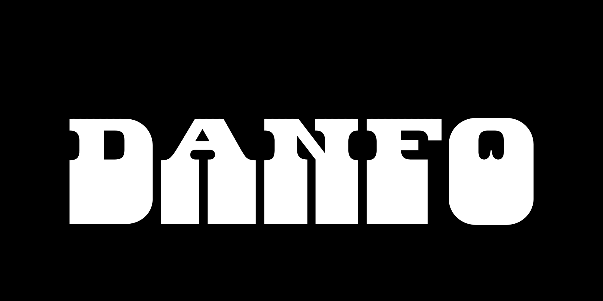
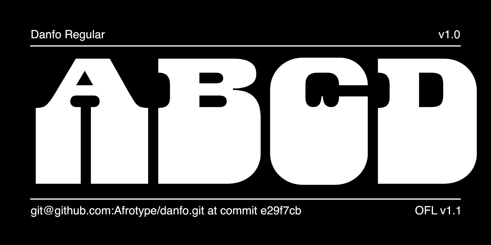
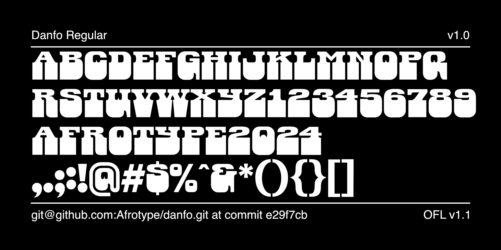

# Danfo

[![][Fontbakery]](https://Afrotype.github.io/danfobase/fontbakery/fontbakery-report.html)
[![][Universal]](https://Afrotype.github.io/danfobase/fontbakery/fontbakery-report.html)
[![][GF Profile]](https://Afrotype.github.io/danfobase/fontbakery/fontbakery-report.html)
[![][Outline Correctness]](https://Afrotype.github.io/danfobase/fontbakery/fontbakery-report.html)
[![][Shaping]](https://Afrotype.github.io/danfobase/fontbakery/fontbakery-report.html)

[Fontbakery]: https://img.shields.io/endpoint?url=https%3A%2F%2Fraw.githubusercontent.com%2FAfrotype%2Fdanfobase%2Fgh-pages%2Fbadges%2Foverall.json
[GF Profile]: https://img.shields.io/endpoint?url=https%3A%2F%2Fraw.githubusercontent.com%2FAfrotype%2Fdanfobase%2Fgh-pages%2Fbadges%2FGoogleFonts.json
[Outline Correctness]: https://img.shields.io/endpoint?url=https%3A%2F%2Fraw.githubusercontent.com%2FAfrotype%2Fdanfobase%2Fgh-pages%2Fbadges%2FOutlineCorrectnessChecks.json
[Shaping]: https://img.shields.io/endpoint?url=https%3A%2F%2Fraw.githubusercontent.com%2FAfrotype%2Fdanfobase%2Fgh-pages%2Fbadges%2FShapingChecks.json
[Universal]: https://img.shields.io/endpoint?url=https%3A%2F%2Fraw.githubusercontent.com%2FAfrotype%2Fdanfobase%2Fgh-pages%2Fbadges%2FUniversal.json

Danfo is an ELSH axis variable font with three main styles at 0,50, and 100. Danfo covers all of the Google SSA character set. The three styles reflect different cut-out shapes inspired by the vinyl cut-out lettering of the public transportation buses in Lagos, Nigeria.

## About

Afrotype is Seyi Olusanya. David Udoh, and Eyiyemi Adegbite collaborated on the design and drawing work for Danfo. Danfo was produced together with Mirko Velimirović who provided technical, drawing, and font engineering assistance. 

## Building

Fonts are built automatically by GitHub Actions - take a look in the "Actions" tab for the latest build.

If you want to build fonts manually on your own computer:

* `make build` will produce font files.
* `make test` will run [FontBakery](https://github.com/googlefonts/fontbakery)'s quality assurance tests.
* `make proof` will generate HTML proof files.

The proof files and QA tests are also available automatically via GitHub Actions - look at https://Afrotype.github.io/danfobase.

## Changelog

When you update your font (new version or new release), please report all notable changes here, with a date.
[Font Versioning](https://github.com/googlefonts/gf-docs/tree/main/Spec#font-versioning) is based on semver. 
Changelog example:

**26 May 2021. Version 2.13**
- MAJOR Font turned to a variable font.
- SIGNIFICANT New Stylistic sets added.

## License

This Font Software is licensed under the SIL Open Font License, Version 1.1.
This license is available with a FAQ at
https://scripts.sil.org/OFL

## Repository Layout

This font repository structure is inspired by [Unified Font Repository v0.3](https://github.com/unified-font-repository/Unified-Font-Repository), modified for the Google Fonts workflow.
